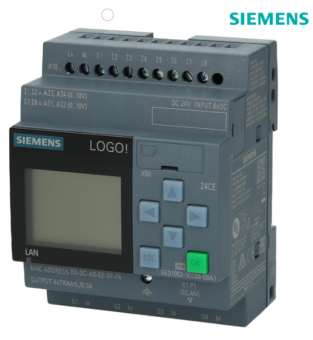

# Happiness Logo!

## Campionati Nazionali Siemens 2024

### Premessa
Con questo progetto gli studenti del Galilei Artiglio hanno voluto dare un piccolo contributo al diritto alla felicità di tutti, in particolare a quella dei piu' piccoli.
Volevamo divertirci e far divertire e per questo abbiamo scelto di collaborare con Luca Bertozzi, un giovane carrista del Carnevale di Viareggio. Il suo carro quest'anno porta in scena la tristezza del mondo, la "pornografia del dolore" dei media raffigurata da un enorme dinosauro che incarna tutta l'aggressività della nostra società. Grazie a questa imponente opera vogliamo contribuire in qualche modo a costruire un antidoto, un momento di felicità, di magia da regalare ai bambini: quale modo migliore se non quello di consentirgli di chiudere la bocca del mostro attraverso un semplice click, facendolo zittire quasi ad esorcizzare la paura e trasformarla in felicità e stupore ?

### Finalità
Il presente progetto ha come finalità il movimento a distanza, azionato mediante smartphone e/o tablet, della bocca del dinosauro di un carro di prima categoria del carnevale di Viareggio, attraverso l'uso di un **Logo! Siemens** collegato ad una rete locale WiFi. 
L'azionamento ha lo scopo di permettere al pubblico presente, specialmente a quello dei piu' piccoli, di poter interagire con la maschera.

### Altre finalità di carattere multidisciplinare
Oltre alle discipine tecniche, il progetto coinvolge anche discipline di tipo umanistico. In particolare (in attesa del contributo Prof.ssa Lencioni su diritto alla felicità e letture Asimov ?...)

### Materiali principali utilizzati per la regolazione ed il controllo
Il sistema di controllo è affidato ad un **PLC Logo!**   

collegato ad un router WiFi  

in modo da realizzare una rete locale protetta su cui connettere il tablet per l'azionamento a distanza

### Materiali principali utilizzati per l'azionamento
Per l'azionamento è stato utilizzato un sistema pneumatico del tipo .... (elenco materiale fornito dal carrista Bertozzi) 

### Schema di progetto
Under Construction

### Under Construction
Stiamo lavorando al progetto: puoi seguire gli sviluppi su questa pagina ...

