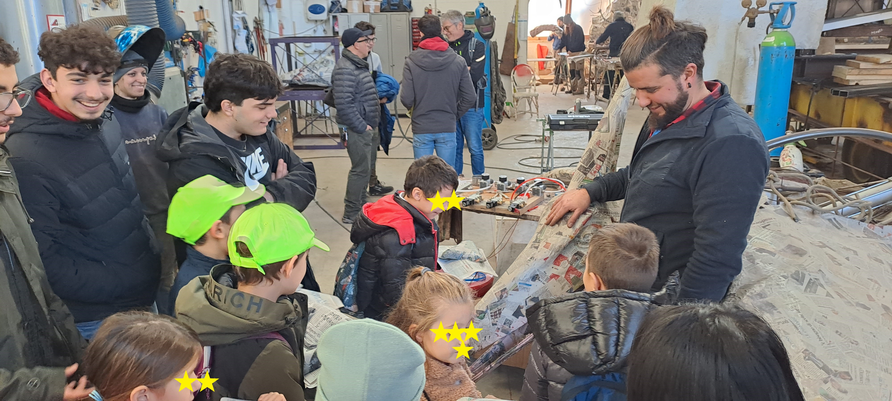
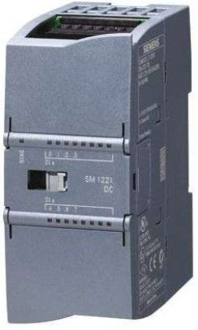
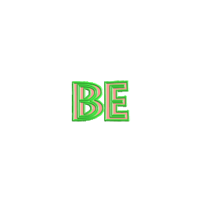

# Happiness S71200!

“Quando avevo cinque anni, mia madre mi ripeteva sempre che la felicità è la chiave della vita. Quando andai a scuola mi domandarono come volessi essere da grande. Io scrissi: felice. Mi dissero che non avevo capito il compito, e io dissi loro che non avevano capito la vita.”    
*John Lennon*

<html lang="en">
<body>
    <audio controls autoplay loop>
        <source src="sound/Girasol.mp3" type="audio/mp3">
    </audio>
    

</body>
</html>
Se vuoi migliorare l'esperienza che il progetto Happiness intende comunicare premi Play e ... buona lettura !!

## Campionati Nazionali Siemens 2024

### Premessa
Può un PLC Siemens regalare un'emozione, un momento di felicità ?

Gli studenti del Galilei Artiglio hanno voluto provare a dare una risposta a questa domanda con un piccolo contributo al diritto alla felicità di tutti, in particolare a quella dei piu' piccoli.

Volevamo divertirci e far divertire e per questo abbiamo scelto di collaborare con Luca Bertozzi, un giovane carrista del Carnevale di Viareggio, titolare dell'impresa artigiana [Luca Bertozzi Scenografie](https://www.lucabertozziscenografie.com/) curatrice di vari allestimenti anche di carattere internazionale tra cui quello riguardante il logo dei Rolling Stones al Summer Festival di Lucca. 
<html lang="en">
<head>
  <meta charset="UTF-8">
  <meta name="viewport" content="width=device-width, initial-scale=1.0">
  <title>Happy boys</title>
  
</head>
<body>
  <figure>
    
    <figcaption>Studenti del Galilei insieme ad una scolaresca nell'hangar del carro "Più denti!"</figcaption>
  </figure>
</body>
</html>

Il suo carro quest'anno porta in scena la tristezza del mondo, la "pornografia del dolore" spettacolarizzata dai media e qui raffigurata da un enorme dinosauro che incarna tutta l'aggressività della nostra società assuefatta dal consumismo e sempre più infelice, in cerca di sensazionalità e visibilità, a scapito dei valori umani. 
Attraverso questa imponente opera vogliamo contribuire in qualche modo a costruire un antidoto, un momento di felicità, di magia da regalare ai bambini: quale modo migliore se non quello di consentirgli di chiudere la bocca del mostro attraverso un semplice click, facendolo zittire quasi ad esorcizzare la paura e trasformarla in felicità e stupore ?

### Finalità
Il presente progetto ha come finalità il movimento a distanza, azionato mediante smartphone e/o tablet, di parti del dinosauro di un carro di prima categoria del carnevale di Viareggio, attraverso l'uso di un **PLC S71200 Siemens** collegato ad una rete locale WiFi. 
L'azionamento ha lo scopo di permettere al pubblico presente, specialmente a quello dei piu' piccoli, di poter interagire con la maschera.

### Breve descrizione del contesto di progetto
Tra i carri di prima categoria, al [Carnevale di Viareggio](https://viareggio.ilcarnevale.com/la-storia/storia-e-tradizione/) edizione 2024, il carro di Luca Bertozzi è tra i piu' imponenti avendo una lunghezza di circa 20 metri ed una altezza di oltre 5 metri. E' di fatto un dinosauro scala 1:1. Da un punto di vista tecnico il carro, alimentato attraverso un gruppo elettrogeno, costituisce un sistema elettrico mobile a servizio delle luci, della musica e dell'impianto pneumatico ad 8 bar necessario per azionare i movimenti delle maschere di cartapesta del complesso scenografico. Il carro si muove su 6 ruote ed ha un peso di diverse tonnellate.

E' tradizione che i movimenti delle maschere siano sempre stati affidati all'ingegno ed alla forza umana sfruttando sostanzialmente il principio della leva con l'ausilio di contrappesi e di tiranti elastici realizzati con camere d'aria di pneumatici di camion. Ma ci sono anche altre ragioni pratiche che tendono ad escludere l'impiego di sistemi automatici. Un carro imponente come questo sollecitato da decine di persone che ci ballano sopra e che si muove sui viali a mare esposto al vento ed a leggere incurvature della strada, può avere modifiche di assetto importanti a scapito delle tolleranze di cerniere, cuscinetti ecc. con il risultato che i movimenti previsti in fase di costruzione vengano completamente scombinati. In situazioni come queste il movimento manuale sopperisce ad intoppi legati ad una serie di variabili a volte difficili da prevedere.

La sfida tecnica quindi che il Galilei Artiglio raccoglie è quella di utilizzare un PLC S71200 che attraverso il proprio Web Server è in grado di essere "riconfigurato" nelle variabili di controllo in tempo reale mediante un tablet e/o uno smartphone durante il corso mascherato. Oltre ai controlli "virtuali" sono previsti anche ingressi fisici per la necessaria ridondanza di sicurezza del carro. 

### Materiali principali utilizzati per la regolazione ed il controllo
Il sistema di controllo è affidato ad un **PLC S71200**    

completo di blocco di espansione **SM1222**  per il controllo delle elettrovavolvole dei pistoni pneumatici.

Il PLC è infine collegato ad un router WiFi  

in modo da realizzare una rete locale protetta su cui connettere il tablet per l'azionamento a distanza delle maschere.

La realizzazione di una rete locale WiFi ad hoc per il PLC S7 1200 è condizione essenziale per il successo dell'impresa. Infatti durante il corso, a causa dell'alto numero delle presenze o per altri motivi di sicurezza pubblica, la connessione alla rete tramite le celle telefoniche non è garantita ovunque ed in ogni momento. Si è optato quindi per un router WiFi piccolo e potente in grado di superare la schermatura della struttura portante in ferro del carro. Questo permette di poter dialogare con il PLC dall'esterno a diversi metri di distanza dalla maschera, così da far vivere al meglio l'esperienza al pubblico.

### Video del progetto Happiness
Video di presentazione del progetto al Campionato Nazionale Siemens 2024

<iframe width="640" height="320" src="https://youtube.com/embed/oKHkwgb3gDY" ></iframe>

### Dicono di noi
[Articolo di giornale sul quotidiano "La Nazione"](https://www.lanazione.it/viareggio/cronaca/tyrannosaurus-web-techno-automatismi-sul-carro-di-bertozzi-7ee88b29) 

### Ringraziamenti
Gli studenti dell'IIS Galilei-Artiglio impegnati nel progetto ringraziano Luca Bertozzi e tutte le maestranze impegnate nella realizzazione del carro che ci hanno permesso di lavorare fianco a fianco anche nei momenti concitati a ridosso dell'inizio della manifestazione del Carnevale di Viareggio.

Un particolare ringraziamento va a tutti i bambini ed i genitori che hanno interagito con la maschera, in particolare a quelli che che per motivi di tempo non sono stati inseriti nel video di presentazione. 

Per tutti, ma proprio tutti tutti, va il nostro augurio  

                

