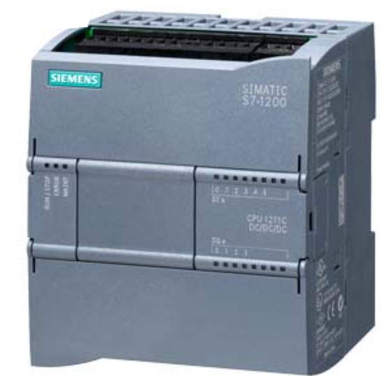
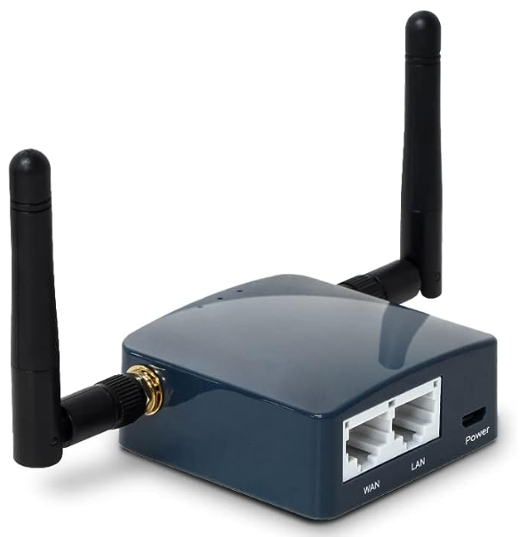

# Happiness S71200!

“Quando avevo cinque anni, mia madre mi ripeteva sempre che la felicità è la chiave della vita. Quando andai a scuola mi domandarono come volessi essere da grande. Io scrissi: felice. Mi dissero che non avevo capito il compito, e io dissi loro che non avevano capito la vita.”    
*John Lennon*

## Campionati Nazionali Siemens 2024

### Premessa
Può un PLC Siemens regalare un'emozione, un momento di felicità ?
Gli studenti del Galilei Artiglio hanno voluto provare a dare una risposta a questa domanda con un piccolo contributo al diritto alla felicità di tutti, in particolare a quella dei piu' piccoli.
Volevamo divertirci e far divertire e per questo abbiamo scelto di collaborare con Luca Bertozzi, un giovane carrista del Carnevale di Viareggio. Il suo carro quest'anno porta in scena la tristezza del mondo, la "pornografia del dolore" spettacolarizzata attraverso i media e qui raffigurata da un enorme dinosauro che incarna tutta l'aggressività della nostra società assuefatta dal consumismo e sempre più infelice, in cerca di sensazionalità e visibilità, a scapito dei valori umani. Attraverso questa imponente opera vogliamo contribuire in qualche modo a costruire un antidoto, un momento di felicità, di magia da regalare ai bambini: quale modo migliore se non quello di consentirgli di chiudere la bocca del mostro attraverso un semplice click, facendolo zittire quasi ad esorcizzare la paura e trasformarla in felicità e stupore ?

### Finalità
Il presente progetto ha come finalità il movimento a distanza, azionato mediante smartphone e/o tablet, della bocca del dinosauro di un carro di prima categoria del carnevale di Viareggio, attraverso l'uso di un **S71200 Siemens** collegato ad una rete locale WiFi. 
L'azionamento ha lo scopo di permettere al pubblico presente, specialmente a quello dei piu' piccoli, di poter interagire con la maschera.

### Altre finalità di carattere multidisciplinare
Oltre alle discipine tecniche, il progetto coinvolge anche discipline di tipo umanistico. In particolare (in attesa del contributo Prof.ssa Lencioni su diritto alla felicità e letture Asimov ?...)

### Breve descrizione del contesto di progetto
Tra i carri di prima categoria, al [Carnevale di Viareggio](https://viareggio.ilcarnevale.com/la-storia/storia-e-tradizione/) edizione 2024, il carro di Luca Bertozzi è tra i piu' imponenti avendo una lunghezza che supera i 14 metri ed una altezza di oltre 5 metri. Da un punto di vista tecnico il carro, alimentato attraverso un gruppo elettrogeno, costituisce un sistema elettrico IT mobile a servizio delle luci, della musica e dell'impianto pneumatico ad 8 bar necessario per azionare i movimenti delle maschere di cartapesta del complesso scenografico. Il carro si muove su 6 ruote ed ha un peso stimato intorno alle x tonnellate.

E' tradizione che i movimenti delle maschere siano sempre stati affidati all'ingegno ed alla forza umana sfruttando sostanzialmente il principio della leva con l'ausilio di contrappesi e di tiranti elastici realizzati con camere d'aria di pneumatici di camion. Ma ci sono anche altre ragioni pratiche che tendono ad escludere l'impiego di sistemi automatici. Un carro imponente come questo sollecitato da decine di persone che ci ballano sopra e che si muove sui viali a mare esposto al vento ed a leggere incurvature della strada, può avere modifiche di assetto importanti a scapito delle tolleranze di cerniere, cuscinetti ecc. con il risultato che i movimenti previsti in fase di costruzione vengano completamente scombinati. In situazioni come queste il movimento manuale sopperisce ad intoppi legati ad una serie di variabili a volte difficili da prevedere.

La sfida quindi che il Galilei Artiglio raccoglie è quella di utilizzare un PLC S71200 che attraverso il proprio Web Server è in grado di essere "riconfigurato" nelle variabili di controllo in tempo reale mediante un tablet durante il corso mascherato.

### Materiali principali utilizzati per la regolazione ed il controllo
Il sistema di controllo è affidato ad un **PLC S71200**   

collegato ad un router WiFi  

in modo da realizzare una rete locale protetta su cui connettere il tablet per l'azionamento a distanza

### Materiali principali utilizzati per l'azionamento
Per l'azionamento è stato utilizzato un sistema pneumatico del tipo .... (elenco materiale fornito dal carrista Bertozzi) 

### Schema di progetto
Under Construction

### Under Construction
Stiamo lavorando al progetto: puoi seguire gli sviluppi su questa pagina ...

